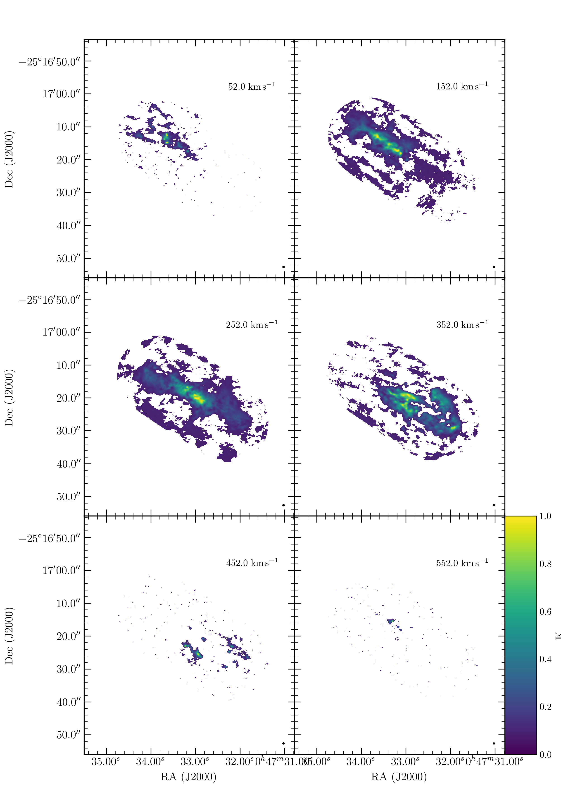

# easy_aplpy
Baking a publication quality plot can involve a fair bit of code. Easy APLpy can make this process much simpler by offering wrapper functions for the most often used types of plots.

For details on APLpy see https://github.com/aplpy/aplpy

# Available wrappers:

### easy_aplpy.plot.map
A one-liner to quickly plot fits image that also look good. This method also provides extensive options to costumize the plot but still keep the code simple.

Running this code:
```
import easy_aplpy
easy_aplpy.plot.map('test_data/map.fits')
```
Produces this plot:


### easy_aplpy.plot.grid
A function to easily plot a grid of images, e.g. the channel maps that are often used in radio astronomy.

Running this code:
```
import easy_aplpy
easy_aplpy.plot.grid('cube.fits', [2,3], [150,200,250,300,350,400])
```
Produces this plot:



# Installation:
Dependencies: astropy==3.2.3, aplpy==1.1.1, matplotlib==3.2.2

> : warning: COMPATIBILITY: APLpy has lots of bug that seem to not get fixed anymore. Consider APLpy at least end-of-life or even deprecated.
> The current version of easy_aplpy was tested with APLpy 1.1.1 / Astropy 3.2.3 / matplotlib 3.2.2 and contains fixes specifically for these versions.
> Compatibility with other versions is a hit-and-miss game.
> APLpy<1.1.1 probably works well with some minor problems. APLpy>=2 removes crucial functionality to make the additional functionality of easy_aplpy work and is therefore not compatible beyond the most simple figures.
> Astropy>=4 restructured some code which breaks parts of APLpy. Aside from some more advanced options, easy_aplpy works with Astropy>=4 and simple figures are possible.
> easy_aplpy requires matplotlib >= 3.0.2 or <3.0 because bugs in versions 3.0.0 & 3.0.1 break APLpy and thus easy_aplpy.

> A general warning regarding APLpy==1.1.1: This version of APLpy has a serious bug that prevents plotting the beam. easy_aplpy reimplements beam plotting to work around this issue. Might be useful to keep this in mind when further customizing an easy_aplpy figure.

## Install with pip:
- install the master branch
```
python -m pip install git+https://github.com/GiantMolecularCloud/easy_aplpy.git
```
- or install a specific branch or commit by specifying it at the end, e.g., the development branch.
```
python -m pip install git+https://github.com/GiantMolecularCloud/easy_aplpy.git@development
```
- import easy_aplpy and run code
    ```
    import easy_aplpy
    easy_aplpy.plot.map(...)
    ```

## Install manually:
- clone this repository or download the scripts
- add the path where the file are located to your python path
    ```
    import sys
    sys.path.append('/your/path/to/easy_aplpy')
    ```
- import the wrapper functions
    ```
    import easy_aplpy
    ```
- call the plotting wrappers with `easy_aplpy.plot`


# Settings
The plotting functions offer many keyword arguments to customize the plots, e.g. by adding scalebars or labels.
General style settings, i.e. settings that do not have to be changed for each plot but maybe once per script or once per project, are stored in a subpackage to be accessed as easy_aplpy.settings.some_setting.
The default settings are listed in the file settings/_settings.py and can be changed there.
Within the code you can directly change any setting which will affect all subsequent plots.
```
import easy_aplpy
easy_aplpy.settings.some_setting = ...
```
Often used settings are tick_label_xformat, ticks_xspacing and the corresponding settings for y.
Check the auto-completion of easy_aplpy.settings or look at the file settings/_settings.py to see what can be changed.

The plotting functions return an APLpy FITSFigure object that can be further customized with the usual APLpy functions. This is to allow further customization that is not possible with the easy_aplpy convenience functions. Note that APLpy 2 severly limited the customization options by blocking access to the underlying matplotlib objects and thus breaking easy_aplpy.

# Examples

Each plotting function offers many optional parameters for customization. Not all of them are listed in the examples below and some options are probably not self-explanatory. See the python help for the full documentation:
e.g. `easy_aplpy.plot.map?` or `easy_aplpy.plot.grid?`

### single map
plot a single channel of a FITS cube, channel specified as number
```
easy_aplpy.plot.map('cube.fits',
    channel = 250
    )
```
[Result](test_data/cube.simple.chan_int.png)


### single map
plot a single channel of a FITS cube, channel specified as velocity (spectroscopic axis is in velocity)
```
easy_aplpy.plot.map('cube.fits',
    channel = 250*u.km/u.s
    )
```
[Result](test_data/cube.simple.chan_unit.png)


### single position-velocity diagram
```
easy_aplpy.plot.map('pv.fits'
    )
```
[Result](test_data/pv.simple.png)


### channel maps
Beside the file name, the number of columns and rows [2,3] (argument 'shape') and which channels to plot [150,...,400] (argument 'channels') must be given.
```
easy_aplpy.plot.grid('cube.fits', [2,3], [150,200,250,300,350,400])
```
[Result](test_data/cube.channelmap.simple.png)


### single map with complex overlays
This time, the map is recentered, uses a custom color scaling and shows various overlays like contours and circles.
```
easy_aplpy.plot.map('cube.fits',
    out      = {'filename': 'cube.complex.png', 'dpi': 300, 'transparent': False},
    channel  = 250*u.km/u.s,
    cmap     = 'viridis',
    vmin     = 1,
    vmax     = 60,
    stretch  = 'log',
    recenter = [SkyCoord('00h47m33.07s -25d17m20.0s'), 40.0*u.arcsec, 32.0*u.arcsec],
    contour  = [['map.fits', [2e3,4e3,6e3], 'black'],
                ['map.fits', [1e3,3e3,5e3], 'white']],
    clabel   = {'fmt': '%i'},
    legend   = True,
    colorbar = ['top', 'brightness temperature [K]'],
    scalebar = [1.0*u.arcsec, 'a few parsec', 'bottom'],
    beam     = 'bottom left',
    circles  = [[SkyCoord('00h47m33.07s -25d17m20.0s'), 10.0*u.arcsec, {'linewidth': 1.0, 'edgecolor':'red'}],
                [SkyCoord('00h47m33.07s -25d17m20.0s'), 20.0*u.arcsec, {'linewidth': 1.0, 'edgecolor':'red'}]]
    )
```
[Result](test_data/cube.complex.png)

### position-velocity diagram with manual formatting
The labels are specified to give more details and nicer formatting than the FITS header provides. Contours are also labeled (argument 'clabel').
```
easy_aplpy.plot.map('pv.fits',
    out     = {'filename': 'pv.complex.png'},
    cmap    = 'jet',
    vmin    = 0.1,
    vmax    = 17,
    stretch = 'log',
    labels  = ['offset ["]','velocity [km\,s$^{-1}$]'],
    recenter = [0.*u.arcsec, 250.*u.km/u.s, 40.*u.arcsec, 500.*u.km/u.s],
    contour  = [['pv.fits', [5,10,15], 'black']],
    clabel   = {'fmt': '%i'},
    colorbar = ['right', 'brightness temperature [K]']
    )
```
[Result](test_data/pv.complex.png)


### Channel map with partial overlays
Contours are drwan for each panel, but only the middle row has additional circles drawn.
```
easy_aplpy.plot.grid('cube.fits', [2,3], [150,200,250,300,350,400],
    out      = {'filename': 'cube.channelmap.complex.png', 'dpi': 300, 'transparent': True},
    vmin     = 0,
    vmax     = 60,
    stretch  = 'linear',
    contours = [[['cube.fits', 150, [2.5,5,10,20,40], 'black']],
                [['cube.fits', 200, [2.5,5,10,20,40], 'black']],
                [['cube.fits', 250, [2.5,5,10,20,40], 'black']],
                [['cube.fits', 300, [2.5,5,10,20,40], 'black']],
                [['cube.fits', 350, [2.5,5,10,20,40], 'black']],
                [['cube.fits', 400, [2.5,5,10,20,40], 'black']]],
    circles  = [[],
                [],
                [[SkyCoord('00h47m33.07s -25d17m20.0s'), 10.0*u.arcsec, {'linewidth': 1.0, 'edgecolor':'red'}],[SkyCoord('00h47m33.07s -25d17m20.0s'), 20.0*u.arcsec, {'linewidth': 1.0, 'edgecolor':'red'}]],
                [[SkyCoord('00h47m33.07s -25d17m20.0s'), 10.0*u.arcsec, {'linewidth': 1.0, 'edgecolor':'red'}],[SkyCoord('00h47m33.07s -25d17m20.0s'), 20.0*u.arcsec, {'linewidth': 1.0, 'edgecolor':'red'}]],
                [],
                []],
    scalebar = [5.0*u.arcsec, 'some distance', 'bottom'],
    colorbar = ['last panel', 'some units']                     # or ['right', 'some units']
    )
```
[Result](test_data/cube.channelmap.complex.last_panel.png) or [Result](test_data/cube.channelmap.complex.right.png)
